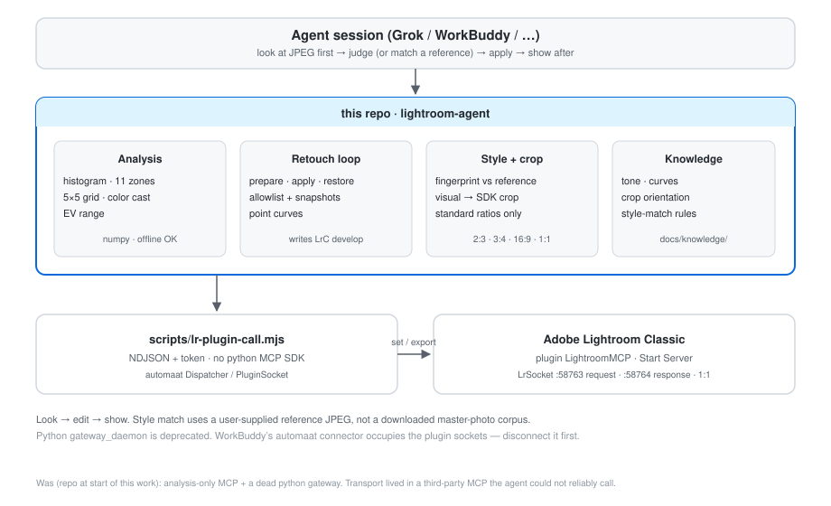

<div align="center">

# Lightroom Agent

**See the photo, write Lightroom, show the result — numbers you can check.**

[](LICENSE)
[](https://www.python.org)
[](https://modelcontextprotocol.io)

[Features](#features) · [Install](#installation) · [Usage](#usage) · [Knowledge](docs/knowledge/README.md) · [Limitations](#honest-limitations)

</div>

Third-party Lightroom MCPs can move sliders. They cannot tell whether the sky is clipping, whether `CropTop` on a portrait RAW is actually the left edge, or how far this harbor is from a reference JPEG you dropped in chat.

This repo is the **eyes + hands + a small style mapper** for an agent sitting in Lightroom Classic:

1. Export the current photo and **look** (vision if the model can see; histogram if it cannot).
2. Write allowlisted develop settings (basic panel, HSL, point curve, standard-ratio crop).
3. Export again and **show** the after. Undo is a snapshot, not LrC history.

<p align="center">
  
</p>

## Features

- **`analyze_photo` / `batch_analyze`** — R/G/B/Lum stats, clip, Adams 11 zones, 5×5 grid, color cast, EV range
- **`prepare_retouch_photo` → `apply_retouch_photo` → `restore_retouch_photo`** — look first, then write, then show
- **`propose_style_match_photo`** — fingerprint current vs a reference JPEG, emit a develop prescription (does not write)
- **Crop** — visual sides mapped through orientation (`DA` portrait NEF); only `1:1` `2:3` `3:2` `3:4` `4:3` `4:5` `16:9` `9:16`
- **Point curves** — `ToneCurvePV2012` 0–255 pairs
- **Direct plugin CLI** — `scripts/lr-plugin-call.mjs` (no python MCP SDK, no WorkBuddy `oneOf`)

## Requirements

| | |
|---|---|
| OS | macOS (Lightroom Classic + this plugin path) |
| Lightroom | Classic, plugin **Start Server**, sockets `:58763/:58764` **free** (disconnect WorkBuddy’s automaat connector) |
| Runtime | Python 3.11+, Node 18+ |
| GPU | None. Analysis is numpy on an 8-bit JPEG |

## Installation

```bash
git clone https://github.com/Jungod1121/lightroom-agent.git
cd lightroom-agent/server
python3 -m venv .venv
./.venv/bin/pip install -r requirements.txt
```

MCP client config:

```json
{
  "mcpServers": {
    "lightroom-analysis": {
      "command": "/absolute/path/to/lightroom-agent/server/.venv/bin/python",
      "args": ["-m", "lightroom_agent.main"],
      "env": { "PYTHONPATH": "/absolute/path/to/lightroom-agent/server" }
    }
  }
}
```

Set `LRMCP_AUTOMAAT_DIST` to automaat’s `server/dist` if it is not `~/repositories/lightroom-mcp-automaat/server/dist`.

## Usage

**Analyze a JPEG (no Lightroom):**

```bash
cd lightroom-agent/server
./.venv/bin/python -c "
from lightroom_agent.analysis.histogram import analyze
print(analyze('photo.jpg').to_dict()['statistics']['Lum'])
"
```

**Retouch loop** ([`skills/lightroom-retouch/SKILL.md`](skills/lightroom-retouch/SKILL.md)):

```
get_selected_photos
→ prepare_retouch_photo          # export + snapshot, no catalog write
→ READ jpeg_path
→ apply_retouch_photo(settings)  # allowlisted develop + crop
→ SHOW after_path
```

**Match a reference still:**

```
propose_style_match_photo(photo_id, "/path/to/reference.jpg")
→ look at both pictures
→ apply_retouch_photo(returned settings, plus a 2:3 / 3:4 window if cropping)
```

Do **not** call `adjust_develop_settings` (automaat 0.13 has no such tool).

```bash
node scripts/lr-plugin-call.mjs ping
node scripts/lr-plugin-call.mjs get_photo_metadata '{"photo_id":"7007"}'
cd server && ./.venv/bin/python -m unittest discover -s tests
```

## What changed vs the original repo

| Then | Now |
|---|---|
| Analysis MCP only; “no Lightroom operation logic” | prepare / apply / restore write develop through the plugin |
| Python `gateway_daemon` (never connected) | **Deprecated.** Node CLI talks NDJSON to LrSocket |
| `adjust_develop_settings` in demos (does not exist) | `set_develop_settings` + allowlist |
| Crop = raw `CropTop` | Orientation-aware visual crop; standard ratios only |
| No curves | `ToneCurvePV2012` |
| Roadmap: “style fingerprinting” | `propose_style_match_photo` from a **user** reference JPEG |
| Zero tests | unittest: histogram, prescription, crop, style gap, loop |

## Honest limitations

- LrSocket is **1:1**. If WorkBuddy holds automaat, this CLI cannot connect.
- Style match moves global tone/color toward the reference. It will not copy composition, boats, or skyline. Amplitude still needs a look.
- Histogram `suggestions` misfire on night/teal looks — evidence, not a prescription.
- No masks, no calibration, no downloaded “master photo” corpus (copyright + wrong photographer).
- `demo1_diagnose.py` / `demo3_verify.py` still use the dead python MCP client.

## Documentation

- [Architecture](docs/architecture.svg)
- [Knowledge: tone, curves, crop, style](docs/knowledge/README.md)
- [Gateway status (deprecated python path)](docs/gateway-status.md)
- [LrSocket archive](archive/README.md)

## Contributing

Issues and PRs welcome. Run `python -m unittest discover -s tests` from `server/`.

## License

[Apache-2.0](LICENSE) © lightroom-agent contributors
