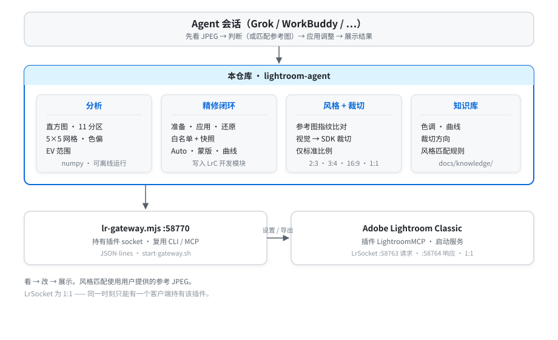

<div align="center">

# Lightroom Agent

**一个能看见 Lightroom 照片、改完再把结果给你看的 Agent。**

[English](README.md) · **简体中文**

[](LICENSE)
[](https://www.python.org)
[](https://modelcontextprotocol.io)

[功能特性](#功能特性) · [安装](#安装) · [使用](#使用) · [文档](#文档) · [限制](#限制)

</div>

Lightroom 的 MCP 桥可以拖滑块，但说不出天空有没有飞、竖拍 RAW 的 `CropTop` 是不是左边，也说不出这张港湾离你丢进对话的 JPEG 有多远。

本仓库给坐在 Lightroom Classic 里的 Agent 当眼睛和手：导出渲染图，测量（或直接看），写入白名单 develop，再导出给你看。撤销是上一份 develop 快照，不是 LrC 历史。

<p align="center">
  
</p>

## 功能特性

- **看** — 8 位渲染图上的直方图、clip、Adams 11 区、5×5 测光、色偏、EV
- **改** — 基本面板、HSL、点曲线、Lightroom Auto（Sensei）、AI 蒙版（天空 / 主体 / 背景）、线性 / 径向渐变、标准比例裁切
- **对例图** — 给参考 JPEG 做指纹，输出 develop 处方（全局 + 天空带 + 水面带）
- **闭环** — 准备（不写目录）→ 应用 → 还原
- **连 LrC** — `scripts/lr-plugin-call.mjs`；多客户端走 `scripts/start-gateway.sh`

## 安装

需要 **macOS**、**Lightroom Classic**（MCP 插件 **Start Server**）、**Python 3.11+**、**Node 18+**。不用 GPU。

```bash
git clone https://github.com/Jungod1121/lightroom-agent.git
cd lightroom-agent
chmod +x scripts/*.sh
./scripts/install.sh
./scripts/start-gateway.sh
# Lightroom → 插件管理器 → Lightroom MCP → Start Server，然后重新加载
node scripts/lr-plugin-call.mjs ping
```

MCP 客户端：

```json
{
  "mcpServers": {
    "lightroom-analysis": {
      "command": "/absolute/path/to/lightroom-agent/server/.venv/bin/python",
      "args": ["-m", "lightroom_agent.main"],
      "env": { "PYTHONPATH": "/absolute/path/to/lightroom-agent/server" }
    }
  }
}
```

若 automaat 的 `server/dist` 不在 `~/repositories/lightroom-mcp-automaat/server/dist`，设置 `LRMCP_AUTOMAAT_DIST`。

## 使用

分析 JPEG（不需要 Lightroom）：

```bash
cd lightroom-agent/server
./.venv/bin/python -c "
from lightroom_agent.analysis.histogram import analyze
print(analyze('harbor.jpg').to_dict()['statistics']['Lum'])
"
# {'mean': 125.37, 'median': 136.0, 'hl_clip_pct': 0.0, 'sh_clip_pct': 0.45, ...}
```

跟 Lightroom 说话：

```bash
node scripts/lr-plugin-call.mjs ping
node scripts/lr-plugin-call.mjs get_photo_metadata '{"photo_id":"7007"}'
```

修图闭环（技能：[`skills/lightroom-retouch/SKILL.md`](skills/lightroom-retouch/SKILL.md)）：

```
get_selected_photos
→ prepare_retouch_photo      # 导出 + 快照；目录不变
→ look at jpeg_path
→ apply_retouch_photo(...)   # 白名单 develop + 裁切
→ show after_path
```

对例图，或跑 Classic 自动：

```
propose_style_match_photo(photo_id, "/path/to/reference.jpg")
apply_auto_tone_photo(photo_id, snapshot_id)   # Develop 里的 Auto
create_ai_mask_photo(photo_id, "sky")         # 需插件已 Reload
```

裁切用屏幕上的上/左/下/右，经朝向映射到 SDK。比例：`1:1` `2:3` `3:2` `3:4` `4:3` `4:5` `16:9` `9:16`。

```bash
cd server && ./.venv/bin/python -m unittest discover -s tests
```

## 相关项目

只当手的 Lightroom MCP：[automaat/lightroom-mcp](https://github.com/automaat/lightroom-mcp)、[shiyiai/lightroom-mcp](https://github.com/shiyiai/lightroom-mcp)、[drshy-org/lightroom-py](https://github.com/drshy-org/lightroom-py)。

也能闭环的 Agent：[John-owo/photo-agent](https://github.com/John-owo/photo-agent)、[Birni/lightroom-mcp](https://github.com/Birni/lightroom-mcp)、[YaddyVirus/darktable-mcp](https://github.com/YaddyVirus/darktable-mcp)（darktable）。Codex 点 Photoshop Camera Raw 是 GUI 自动化，不是目录 API。

本仓库：**可测量的渲染 + 写入 LrC develop + 用户给的风格 JPEG**。

## 限制

- Lua 层插件 socket 仍是 **1:1**。用 `scripts/start-gateway.sh` 让 CLI 和 MCP 共用一个持有者；WorkBuddy 请连本仓库 MCP，不要直连 automaat。
- 例图匹配动全局和分区色调，不复制构图。
- 直方图 suggestions 在夜景 / 青色上会误报——当证据，不当处方。
- 没有画笔、修复、污点；AI 天空/主体/渐变蒙版需要插件 Reload 后才认。
- `apply_auto_tone_photo` 是 Classic Auto（8 个滑块），同样要 Reload。

## 文档

- [架构](docs/architecture.zh-CN.svg)（[English](docs/architecture.svg)）
- [色调、曲线、裁切、风格](docs/knowledge/README.md)
- [插件 socket](archive/README.md)

## 参与贡献

欢迎 Issue 和 PR。中英文 README 与两张架构图是一对，改一处就改另一处。测试：

```bash
./.venv/bin/python -m unittest discover -s tests
```

## 许可证

[Apache-2.0](LICENSE) © lightroom-agent contributors
