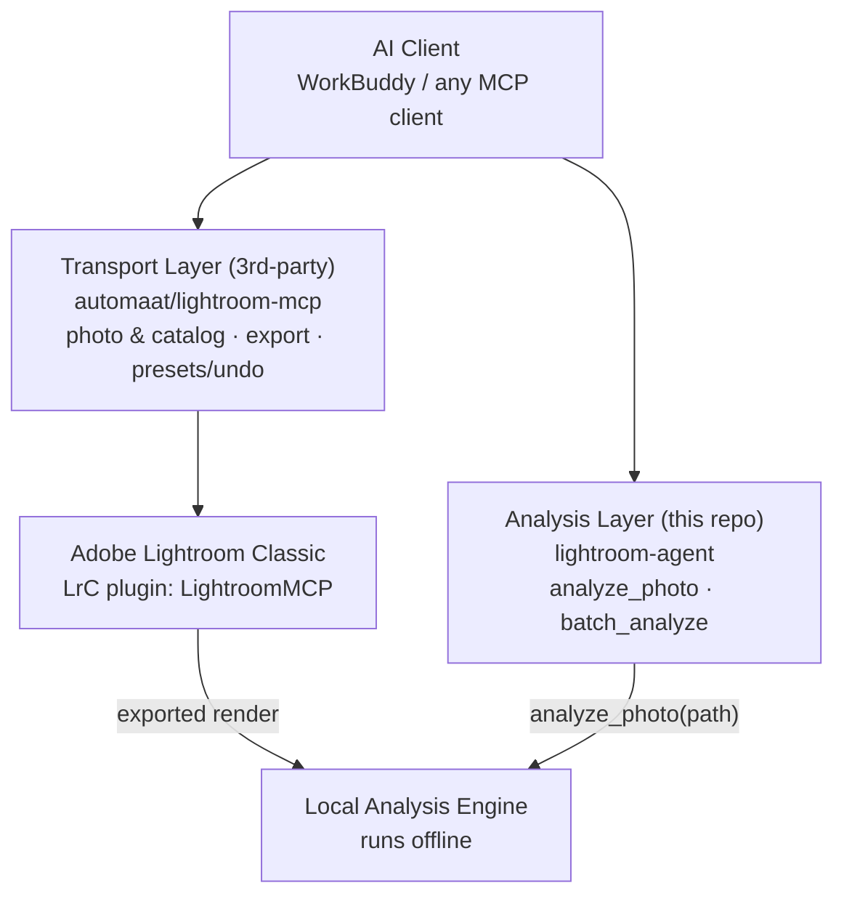

# 架构图生图提示词（GPT Image / GPT-4o Image）

> 用法：把提示词整段贴给 GPT-4o / GPT Image 生成。
> AI 生图对**长文字容易拼错**，生成后检查每个框内的英文拼写；
> 若文字崩了，追加 "keep all text exactly as written, do not alter any letters"。
> 图将出现在 GitHub README（白色页面）中，所以用浅色底、深色字。

## 提示词（英文，推荐）

```
Create a clean, professional software architecture diagram for a technical
README. Flat design, white background, dark gray text (#24292F), thin
light-gray outlines, one restrained accent color (steel blue #0969DA) for
borders of the two main layers. 16:9 wide layout, minimal, documentation-style
(like diagrams in official GitHub project READMEs).

Layout top to bottom:

1. TOP - one wide rounded rectangle labeled "AI Client — WorkBuddy / any MCP client"
   spanning the full width.

2. MIDDLE - two side-by-side rounded rectangles:
   LEFT box titled "Transport Layer (3rd-party)" with subtitle
   "automaat / lightroom-mcp" and three bullet lines:
   "photo & catalog read/write", "export JPEG render", "presets / snapshots / undo".
   RIGHT box titled "Analysis Layer (this repo)" with subtitle
   "lightroom-agent" and two bullet lines:
   "analyze_photo — histogram / zones / color cast", "batch_analyze — consistency scan",
   plus a small badge "self-built · Python MCP". Highlight this box with the
   accent color border to show it is the focus of the repo.

3. BOTTOM - two side-by-side rounded rectangles:
   LEFT box "Adobe Lightroom Classic" with small text "LrC plugin: LightroomMCP".
   RIGHT box "Local Analysis Engine" with small text "runs offline on exported renders".

4. Arrows: from the left middle box down to the Lightroom box (labeled "MCP over LrSocket");
   from the Lightroom box right to the Local Analysis Engine box (labeled "exported render");
   from the right middle box down to the Local Analysis Engine box (labeled "analyze_photo(path)").

Style: minimal flat vector, 2px outlines, rounded corners (radius 10px),
generous whitespace, no gradients, no shadows, no 3D, no decorative icons —
documentation-first, readable at small size. All English text must be spelled
exactly as given.
```

## 提示词（中文对照版）

```
绘制一张面向技术 README 的专业软件架构图：扁平设计，白色背景，深灰文字（#24292F），
浅灰细描边，两个主层用克制的强调色（钢蓝 #0969DA）勾边。16:9 宽幅，极简，
文档风格（类似 GitHub 官方项目 README 里的图）。

从上到下：
1. 顶部：贯穿全宽的圆角矩形「AI Client — WorkBuddy / any MCP client」
2. 中部并排两个圆角矩形：
   左「Transport Layer (3rd-party)」副标题 automaat/lightroom-mcp，
      三条要点：photo & catalog read/write、export JPEG render、presets/snapshots/undo
   右「Analysis Layer (this repo)」副标题 lightroom-agent，
     两条要点：analyze_photo — histogram/zones/color cast、batch_analyze — consistency scan，
      加小徽章 self-built · Python MCP（此框用强调色描边突出）
3. 底部并排两个圆角矩形：
   左「Adobe Lightroom Classic」小字 LrC plugin: LightroomMCP
   右「Local Analysis Engine」小字 runs offline on exported renders
4. 箭头：左中→左下（标注 MCP over LrSocket）；左下→右下（标注 exported render）；
   右中→右下（标注 analyze_photo(path)）

风格：极简扁平矢量，2px 描边，圆角 10px，留白充足，无渐变无阴影无 3D无装饰图标，
小尺寸下依然可读。所有英文文字严格按给定拼写。
```

## 备用：如果生图文字总是崩

架构图建议用确定性工具（零拼写错误、随时改）：
- **Excalidraw** / **draw.io**（手绘风/正式风皆可，十分钟摆完）
- **Mermaid**（README 可直接内嵌渲染）：


