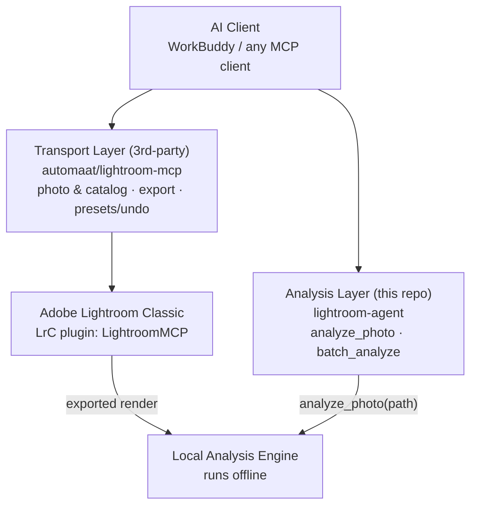

# 架构图生图提示词（GPT Image / GPT-4o Image）

> 用法：把下面的提示词整段贴给 GPT-4o / GPT Image 生成。
> AI 生图对**长文字容易拼错**，建议生成后检查每个框内的英文拼写；
> 若文字崩了，追加一句 "keep all text exactly as written, do not alter any letters"。

## 提示词（英文，推荐）

```
Create a clean, modern software architecture diagram, flat design, on a dark
navy background (#0F1923) with red accents (#FF4655), white text, subtle gray
connection lines with arrowheads. Wide 16:9 layout.

Layout top to bottom:

1. TOP - one wide rounded rectangle labeled "AI Client — WorkBuddy / any MCP client"
   spanning the full width.

2. MIDDLE - two side-by-side rounded rectangles:
   LEFT box titled "Transport Layer (3rd-party)" with subtitle
   "automaat / lightroom-mcp" and three bullet lines:
   "photo & catalog read/write", "export JPEG render", "presets / snapshots / undo".
   RIGHT box titled "Analysis Layer (this repo)" with subtitle
   "lightroom-agent" and two bullet lines:
   "analyze_photo — histogram / zones / color cast", "batch_analyze — consistency scan",
   plus a small badge "self-built · Python MCP".

3. BOTTOM - two side-by-side rounded rectangles:
   LEFT box "Adobe Lightroom Classic" with small text "LrC plugin: LightroomMCP".
   RIGHT box "Local Analysis Engine" with small text "runs offline on exported renders".

4. Arrows: from the left middle box down to the Lightroom box (labeled "MCP over LrSocket");
   from the Lightroom box right to the Local Analysis Engine box (labeled "exported render");
   from the right middle box down to the Local Analysis Engine box (labeled "analyze_photo(path)").

Style: minimal flat vector infographic, thin 2px outlines, rounded corners (radius 12px),
generous spacing, no gradients, no 3D, no icons overload — at most one small camera icon
in the Lightroom box and one small chart icon in the Local Analysis Engine box.
All English text must be spelled exactly as given.
```

## 提示词（中文对照版，若用中文界面生成）

```
绘制一张简洁现代的软件架构图：扁平设计，深墨蓝背景（#0F1923），红色点缀（#FF4655），
白色文字，细灰色连接线带箭头，16:9 宽幅。

从上到下：
1. 顶部：一个贯穿全宽的圆角矩形「AI Client — WorkBuddy / any MCP client」
2. 中部并排两个圆角矩形：
   左「Transport Layer (3rd-party)」副标题 automaat/lightroom-mcp，
      三条要点：photo & catalog read/write、export JPEG render、presets/snapshots/undo
   右「Analysis Layer (this repo)」副标题 lightroom-agent，
      两条要点：analyze_photo — histogram/zones/color cast、batch_analyze — consistency scan，
      加小徽章 self-built · Python MCP
3. 底部并排两个圆角矩形：
   左「Adobe Lightroom Classic」小字 LrC plugin: LightroomMCP
   右「Local Analysis Engine」小字 runs offline on exported renders
4. 箭头：左中→左下（标注 MCP over LrSocket）；左下→右下（标注 exported render）；
   右中→右下（标注 analyze_photo(path)）

风格：极简扁平矢量信息图，2px 细描边，圆角 12px，留白充足，无渐变无 3D，
最多两个小图标（Lightroom 框内相机图标、分析引擎框内图表图标）。
所有英文文字严格按给定拼写。
```

## 备用：如果生图文字总是崩

架构图建议用确定性工具（更专业、零拼写错误）：
- **Excalidraw** / **draw.io**（手绘风/正式风皆可，十分钟摆完）
- **Mermaid**（README 可直接内嵌渲染）：


